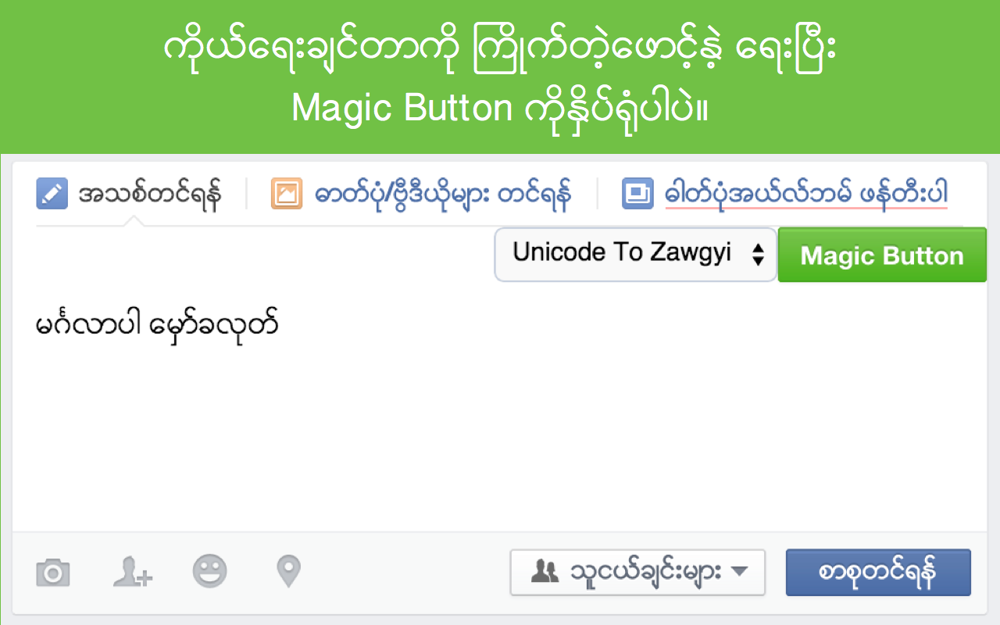
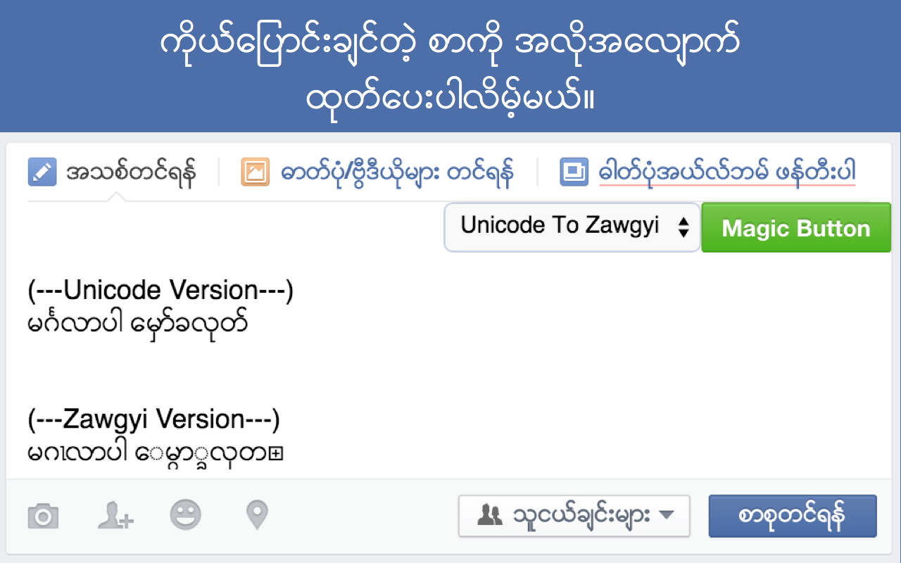

Magic Button
---
Magic Button is a chrome extension which can automagically generate Zawgyi/Unicode version of your facebook status.

Converter
---
Magic Button use [Parabaik](https://github.com/ngwestar/parabaik) converter.
Please note that the accuracy of conversions are up to Parabaik converter.

~~It used [Paytan](https://github.com/trhura/paytan) first but found some bugs on Javascript version of the converter.~~
Todo
---
- Implement Zawgyi to Unicode conversion with Checkbox
- Improve design
- Implement global conversitons for all websites

Testing
---
- Use (MochaJs)[http://mochajs.org/] for test

Contribution
---
Contributions are warmly welcome. I can't really write javascript codes. I just did Magic Button because I needed it. Other people need this too. If you are Javascript ninja, please do contribute!!! 😻

Special thanks to [Thiha Tun](https://github.com/alt332) for helping me along the way.